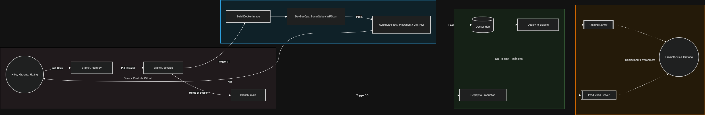

# CI/CD cho hệ thống WordPress



## Tổng quan

Dự án này thiết lập môi trường WordPress với MariaDB sử dụng Docker, bao gồm quản lý biến môi trường an toàn và setup cho testing tự động.

## Cấu trúc

- `docker-compose.yml`: Cấu hình Docker services cho WordPress và MariaDB
- `.env`: Quản lý biến môi trường và mật khẩu database
- `docs/SetupLocalTesting.md`: Hướng dẫn setup môi trường testing local
- `verify-connectivity.sh`: Script kiểm tra kết nối và setup

## Sử dụng

### 1. Environment Configuration

File `.env` chứa các biến môi trường an toàn:
- Mật khẩu database
- Cấu hình WordPress
- Settings cho các môi trường khác nhau

### 2. Setup Local Testing Server với Docker Runner

Xem hướng dẫn chi tiết trong [docs/SetupLocalTesting.md](docs/SetupLocalTesting.md)

**Chạy test tự động:**
```bash
# Khởi động môi trường
docker-compose up -d

# Chạy tests
docker-compose run --rm test-runner
```

### 3. Verify Docker Setup & Connectivity

1. Khởi động containers:
   ```bash
   docker-compose up -d
   ```

2. Chạy script verify:
   ```bash
   bash verify-connectivity.sh
   ```

3. Truy cập WordPress tại http://localhost:8080

## Các Issue đã giải quyết

- Quản lý biến môi trường và mật khẩu database an toàn (.env)
- Setup môi trường testing local (Docker/Ubuntu VM)
- Verify kết nối WordPress với MariaDB và data persistence
